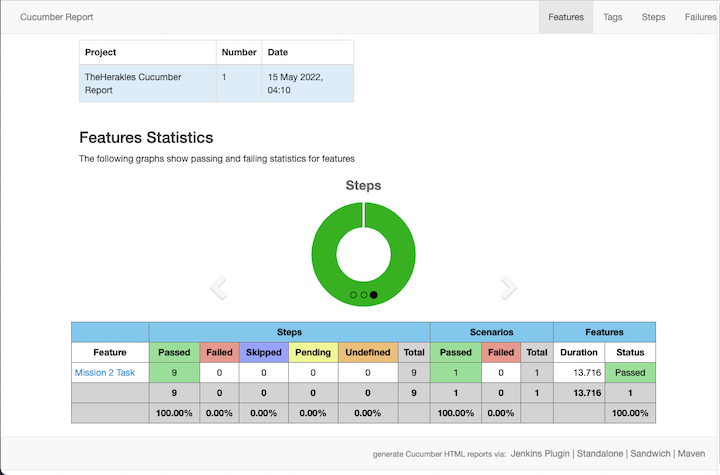

# TheHerakles
### Project Summary
* **[Java 11](https://openjdk.java.net/projects/jdk/11/)** used for development.
* **[Selenium 4.0.0](https://selenium.dev/)** used for browser automation.
* **[WebDriverManager 4.1.0](https://github.com/bonigarcia/webdrivermanager)** Automated driver management.
* Used **[Maven 3.8.4](https://maven.apache.org/docs/3.8.4/release-notes.html)** for build management tool.
* **[Cucumber BDD](https://cucumber.io/)** framework used for testing.
* **[Cucumber JVM: Java](https://mvnrepository.com/artifact/io.cucumber/cucumber-java/5.7.0)** used for testing.
* **[Cucumber JVM: JUnit](https://mvnrepository.com/artifact/io.cucumber/cucumber-junit)** used for testing.
* **[Cucumber Reporting](https://mvnrepository.com/artifact/net.masterthought/cucumber-reporting/5.0.0)** used for pretty html reports for Cucumber.
* OOP used for code structure
* Page Object Pattern used for code structure
* **[Intellij IDEA](https://www.jetbrains.com/idea/)** as IDE


### PROJECT PACKAGE AND FILE STRUCTURE
* 

* Mission 1 Package and File Structure
  * src ↣ main ↣ java
    * MissionOne.java
        
  * Mission 2 Package and File Structure
    * src ↣ test ↣ java ↣ pages
      * Page Object Model for related pages
  
    * src ↣ test ↣ java ↣ runners
      * Contains Test Running, Failed Test runner Classes for Cucumber options, reporting, and tag options.
    * src ↣ test ↣ java ↣ stepdefs
      * Contains step definitions of cucumber scenarios and features.
    * src ↣ test ↣ java ↣ toolbox
      * Class files to support the project.
    * src ↣ test ↣ resources ↣ features
      * Contains scripts written in Gherkin in feature/execution file.
    * target ↣ cucumber-html-reports ↣ overview-features.html
      * Project build result reports in HTML.

## Installation

Install [Maven](https://maven.apache.org/install.html)

Install [JDK](https://docs.oracle.com/en/java/javase/18/install/overview-jdk-installation.html#GUID-8677A77F-231A-40F7-98B9-1FD0B48C346A)

Install the dependencies by running the command below in command line:

```
mvn install
```
## Running Tests

Go to project root directory and open the TestsRunner file

Run all the missions at once on terminal:

```
(clear target folder and reports)
    mvn clear 
(run tests)
    mvn test
(If want to take a look at the reports)
    mvn test -Dcucumber.options="--tags @wip" 
or 
    mvn verify 
    (that will run all the tests and create reports)
```
### Reports



